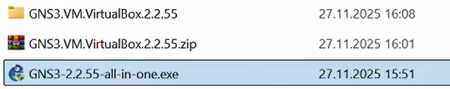
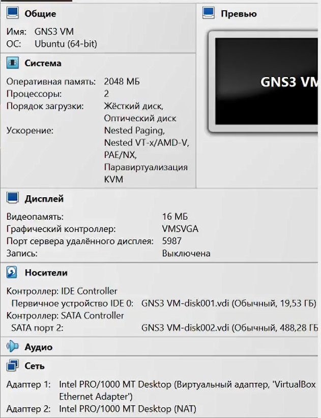
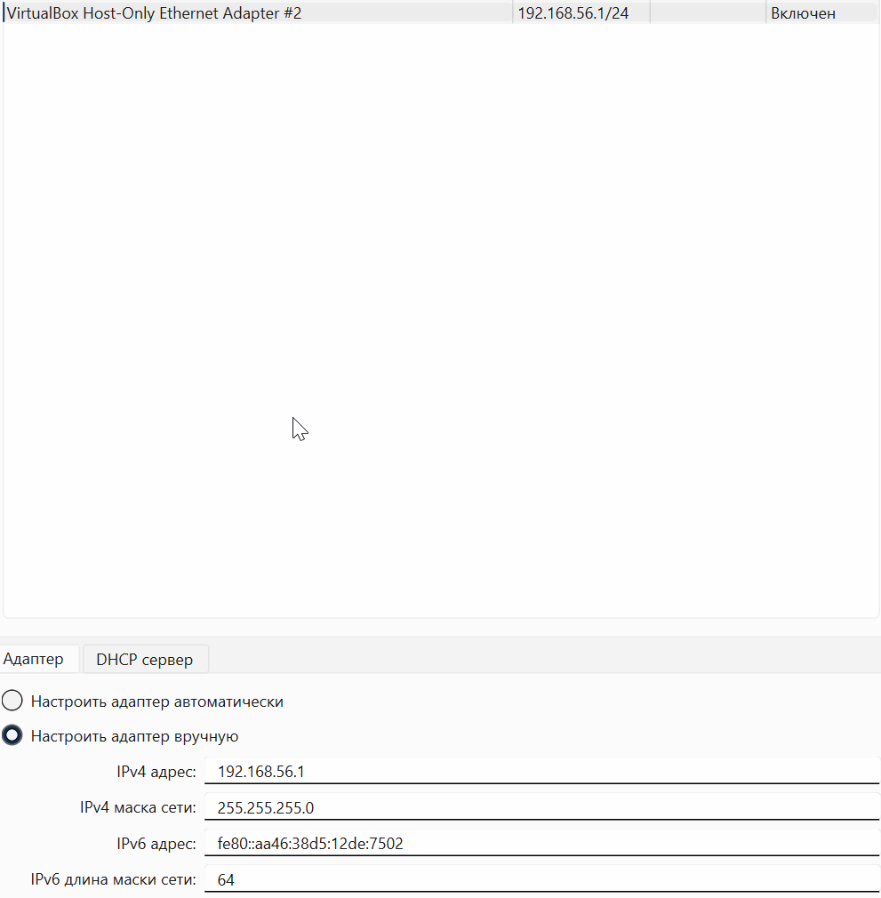
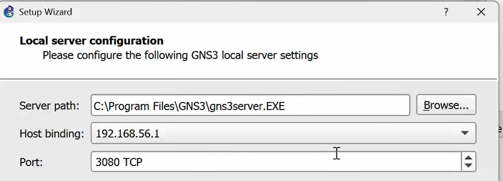
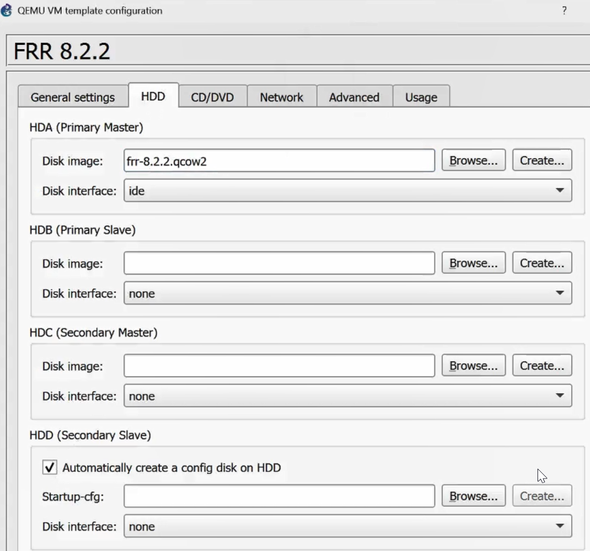
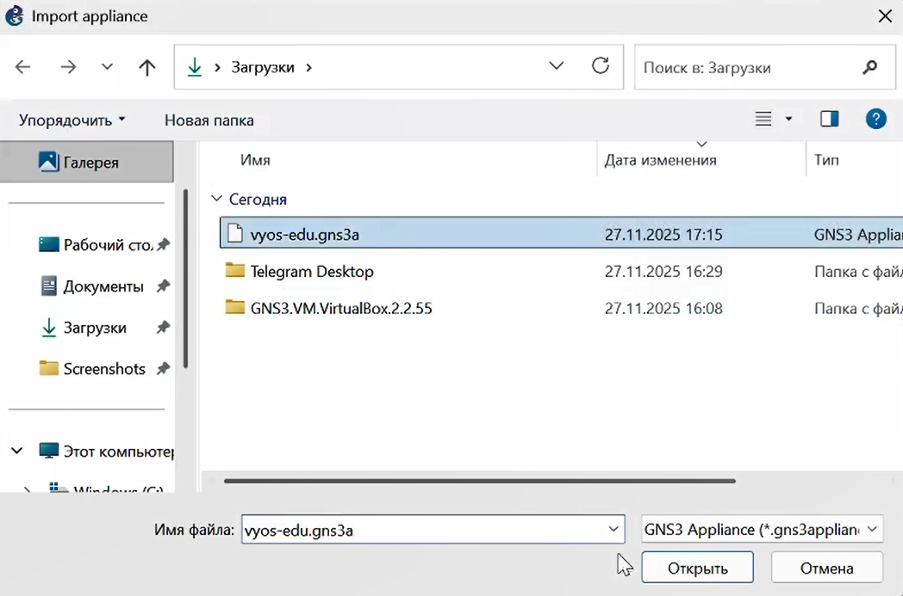

---
## Front matter
lang: ru-RU
title: Лабораторная работа
subtitle: Номер 4
author:
  - Кобзев Д. К. 
institute:
  - Российский университет дружбы народов, Москва, Россия
date: 27 ноября 2025

## i18n babel
babel-lang: russian
babel-otherlangs: english

## Pdf output format
fontsize: 8pt

## Formatting pdf
toc: false
toc-title: Содержание
slide_level: 2
aspectratio: 169
section-titles: true
theme: metropolis
##Fonts
mainfont: Liberation Serif
sansfont: Liberation Sans
monofont: Liberation Mono
---

# Информация

## Докладчик

:::::::::::::: {.columns align=center}
::: {.column width="70%"}

  * Кобзев Дмитрий Константинович
  * Студент
  * Российский университет дружбы народов
  * НПИбд-01-23

:::
::: {.column width="30%"}

:::
::::::::::::::

## Цель работы

Целью данной работы является установка и настройка GNS3 и сопутствующего программного обеспечения.

## Установка GNS3-all-in-one и GNS3 VM для VirtualBox

Устанавливаем файлы GNS3-all-in-one и GNS3 VM для VirtualBox (Рис. 12.1).

{height=60%}

## Установка GNS3 VM для VirtualBox

Устанавливаем виртуальную машину GNS3 VM (Рис. 12.2).

{height=60%}

## Установка GNS3 VM для VirtualBox

Настраиваем вложенную виртуализацию в VirtualBox (Рис. 12.3).

{height=60%}

## Установка GNS3 VM для VirtualBox

Настраиваем сетевой адаптер (Рис. 12.4).

{height=60%}

## Запуск экземпляра GNS3 в VirtualBox

Запускаем  GNS3 VM в VirtualBox (Рис. 12.5).

{height=60%}

## Запуск экземпляра GNS3 в VirtualBox

Указываем настройки локального сервера (Рис. 12.6).

{height=60%}

## Добавление образа маршрутизатора FRR

Добавляем образ маршрутизатора FRR (Рис. 12.7).

{height=60%}

## Добавление образа маршрутизатора FRR

Настраиваем образ маршрутизатора (Рис. 12.8), (Рис. 12.9).

{height=60%}

{height=60%}

## Добавление образа маршрутизатора VyOS

Импортируем vyos-edu.gns3a в GNS3 через пункт меню File>Import appliance (Рис. 12.10).

{height=60%}

## Добавление образа маршрутизатора VyOS

Устанавливаем образ VyOS (Рис. 12.11).

{height=60%}

## Добавление образа маршрутизатора VyOS

Настраиваем образ маршрутизатора (Рис. 12.12).

{height=60%}

## Выводы

В результате выполнения лабораторной работы мною были установлены и настроены GNS3 и сопутствующее программное обеспечения.
