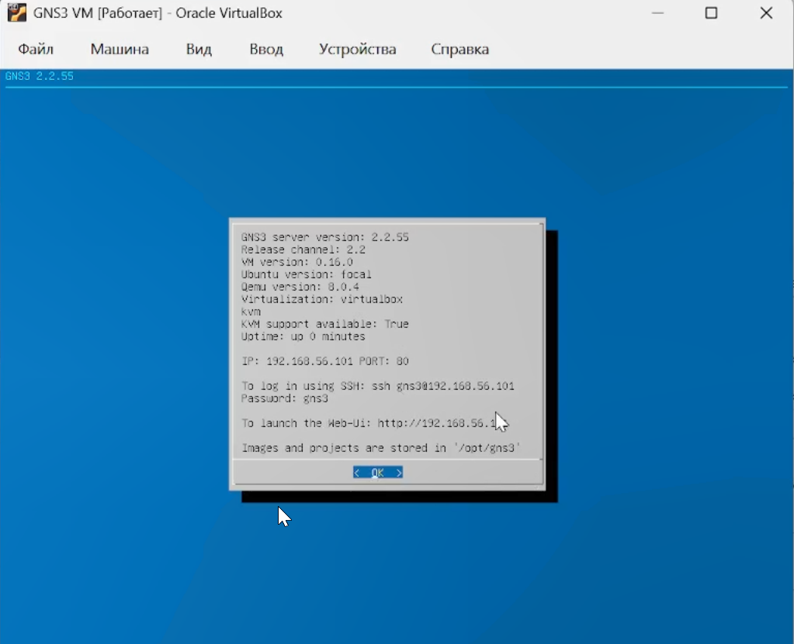
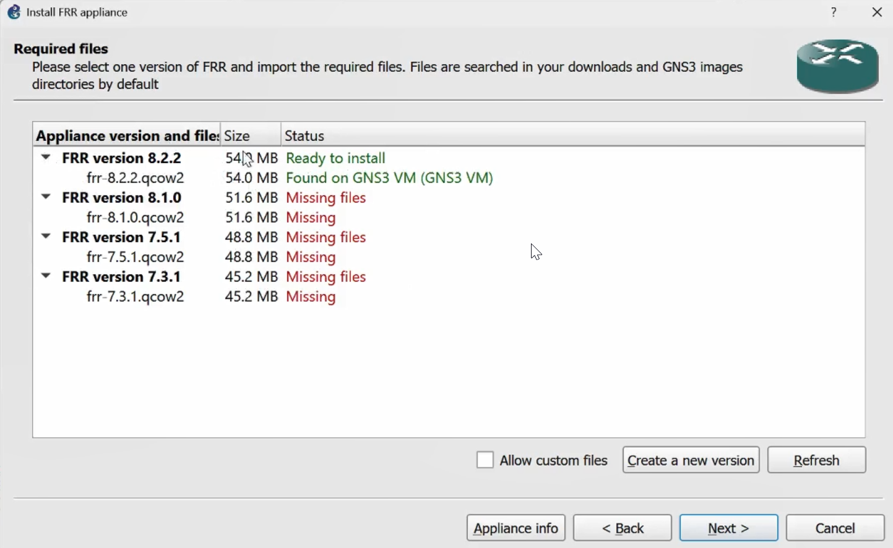
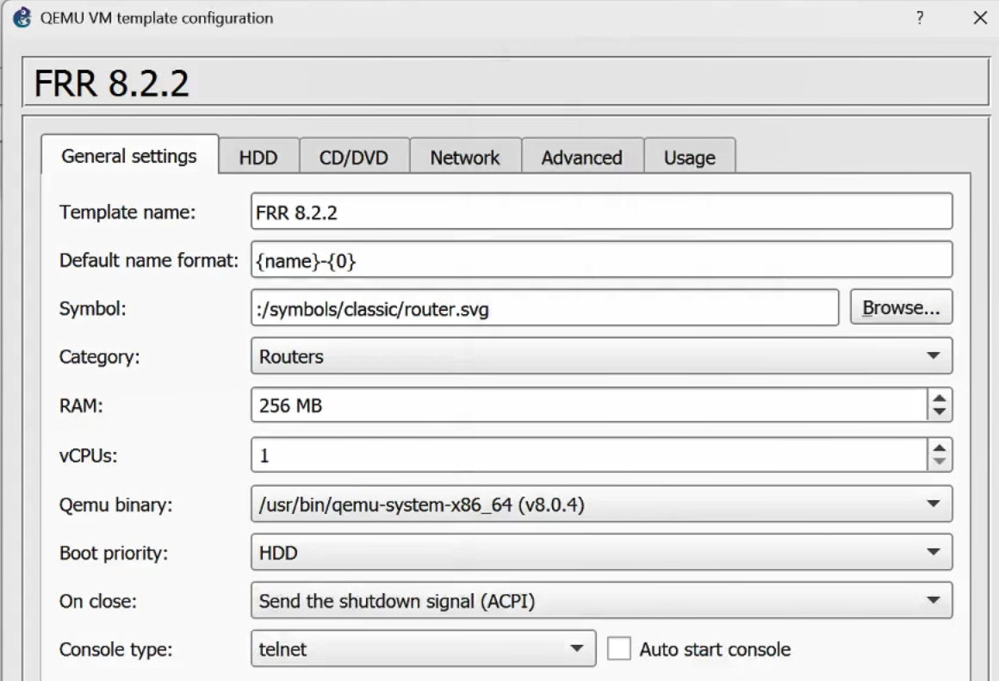
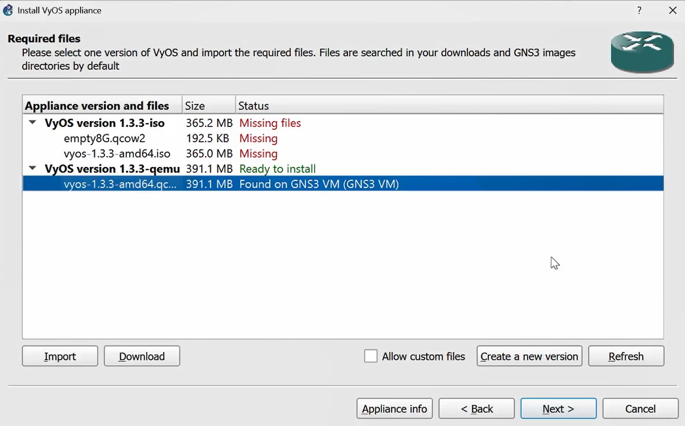
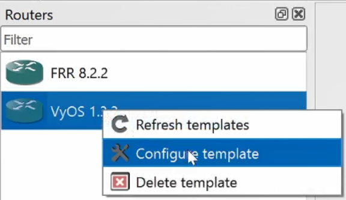

---
## Front matter
title: Лабораторная работа
subtitle: Номер 4
author: "Кобзев Д. К."

## Generic otions
lang: ru-RU
toc-title: "Содержание"

## Bibliography
bibliography: bib/cite.bib
csl: /home/dkkobzev/pandoc/csl/gost-r-7-0-5-2008-numeric.csl

## Pdf output format
toc: true # Table of contents
toc-depth: 2
lof: true # List of figures
lot: true # List of tables
fontsize: 12pt
linestretch: 1.5
papersize: a4
documentclass: scrreprt
## I18n polyglossia
polyglossia-lang:
  name: russian
  options:
	- spelling=modern
	- babelshorthands=true
polyglossia-otherlangs:
  name: english
## I18n babel
babel-lang: russian
babel-otherlangs: english
## Fonts
mainfont: Liberation Serif
romanfont: Liberation Serif
sansfont: Liberation Sans
monofont: Liberation Mono
mathfont: STIX Two Math
mainfontoptions: Ligatures=Common,Ligatures=TeX,Scale=0.94
romanfontoptions: Ligatures=Common,Ligatures=TeX,Scale=0.94
sansfontoptions: Ligatures=Common,Ligatures=TeX,Scale=MatchLowercase,Scale=0.94
monofontoptions: Scale=MatchLowercase,Scale=0.94,FakeStretch=0.9

## Pandoc-crossref LaTeX customization
figureTitle: "Рис."
tableTitle: "Таблица"
listingTitle: "Листинг"
lofTitle: "Список иллюстраций"
lotTitle: "Список таблиц"
lolTitle: "Листинги"
## Misc options
indent: true
header-includes:
  - \usepackage{indentfirst}
  - \usepackage{float} # keep figures where there are in the text
  - \floatplacement{figure}{H} # keep figures where there are in the text
---

# Цель работы

Целью данной работы является установка и настройка GNS3 и сопутствующего программного обеспечения.

# Выполнение лабораторной работы

Устанавливаем файлы GNS3-all-in-one и GNS3 VM для VirtualBox (Рис. 12.1).

{height=60%}

Устанавливаем виртуальную машину GNS3 VM (Рис. 12.2).

{height=60%}

Настраиваем вложенную виртуализацию в VirtualBox (Рис. 12.3).

{height=60%}

Настраиваем сетевой адаптер (Рис. 12.4).

{height=60%}

Запускаем  GNS3 VM в VirtualBox (Рис. 12.5).

{height=60%}

Указываем настройки локального сервера (Рис. 12.6).

{height=60%}

Добавляем образ маршрутизатора FRR (Рис. 12.7).

{height=60%}

Настраиваем образ маршрутизатора (Рис. 12.8), (Рис. 12.9).

{height=60%}

{height=60%}

Импортируем vyos-edu.gns3a в GNS3 через пункт меню File>Import appliance (Рис. 12.10).

{height=60%}

Устанавливаем образ VyOS (Рис. 12.11).

{height=60%}

Настраиваем образ маршрутизатора (Рис. 12.12).

{height=60%}

# Выводы

В результате выполнения лабораторной работы мною были установлены и настроены GNS3 и сопутствующее программное обеспечения.

# Список литературы{.unnumbered}