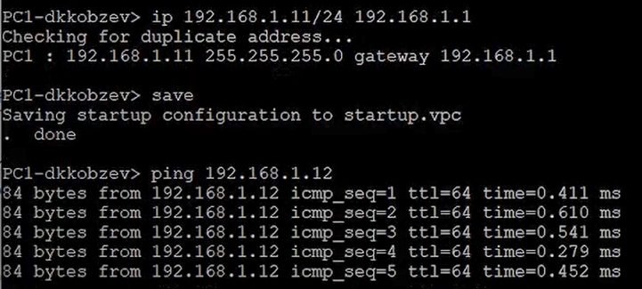
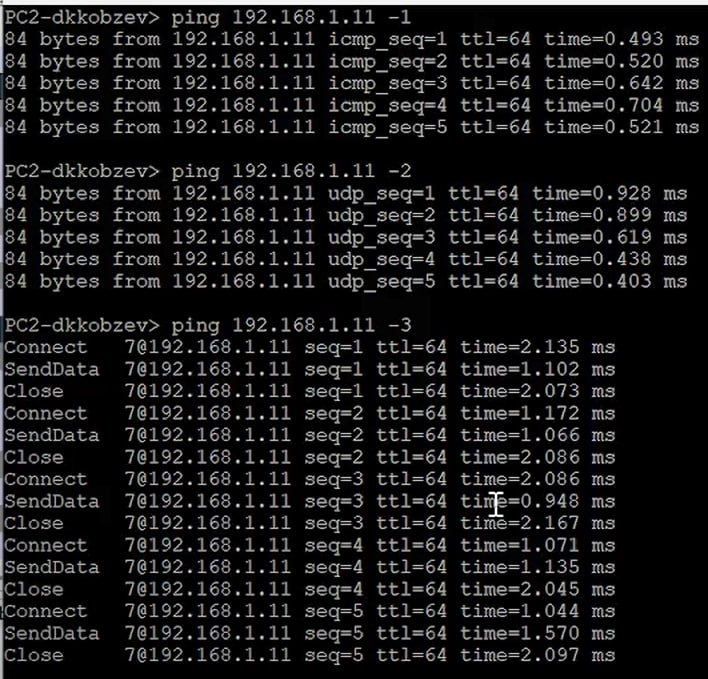
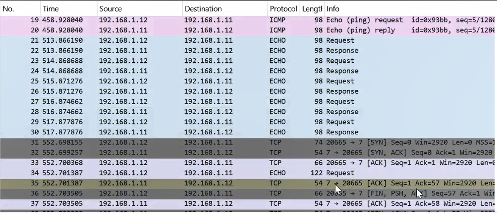
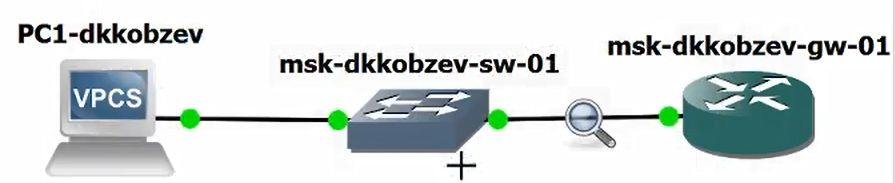
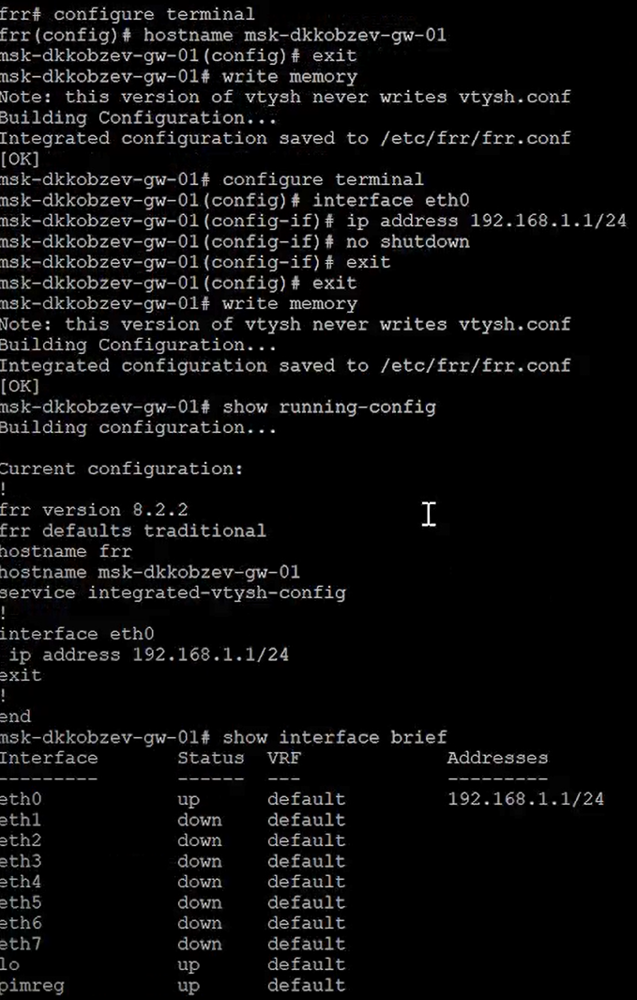
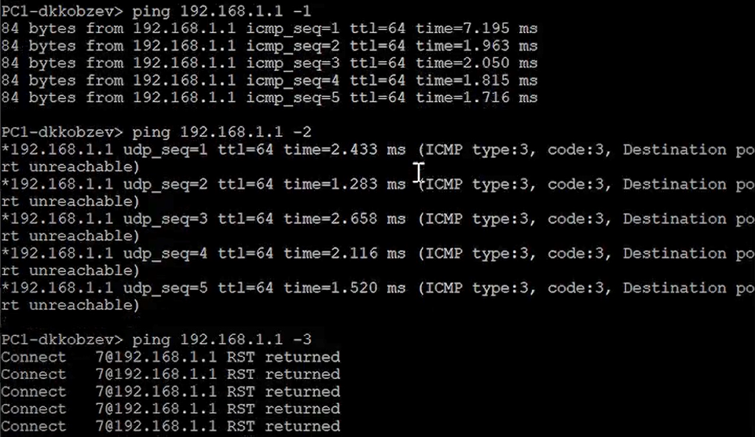
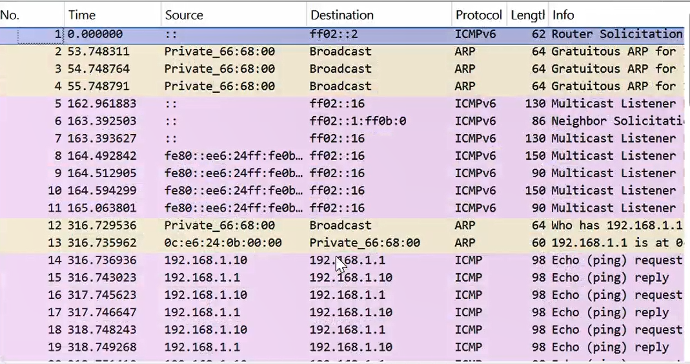
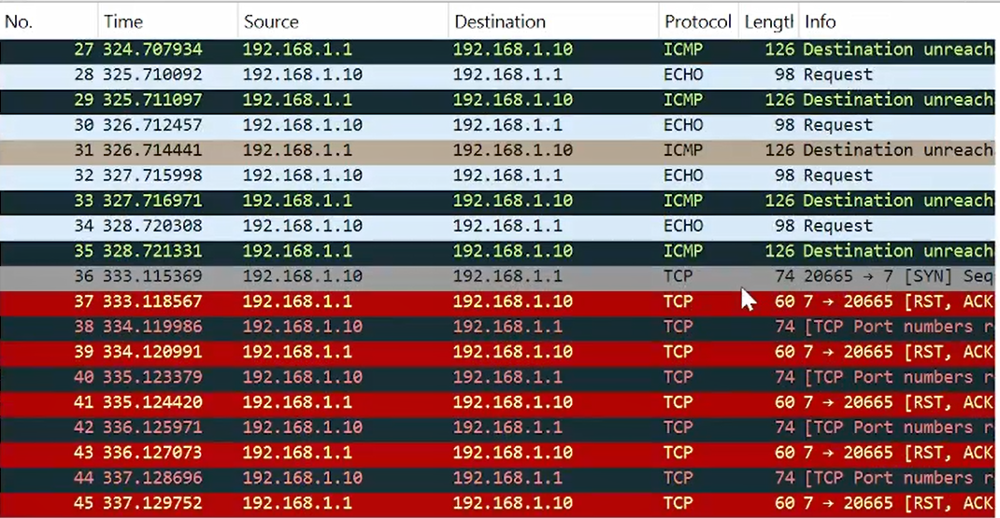
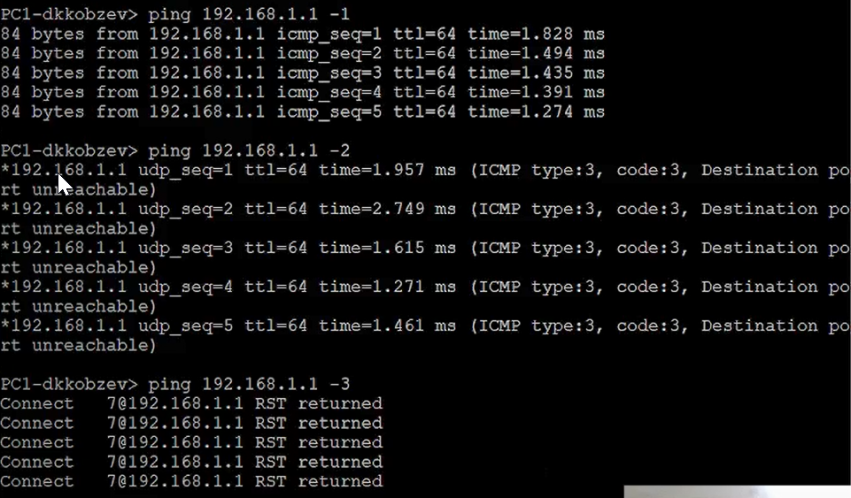
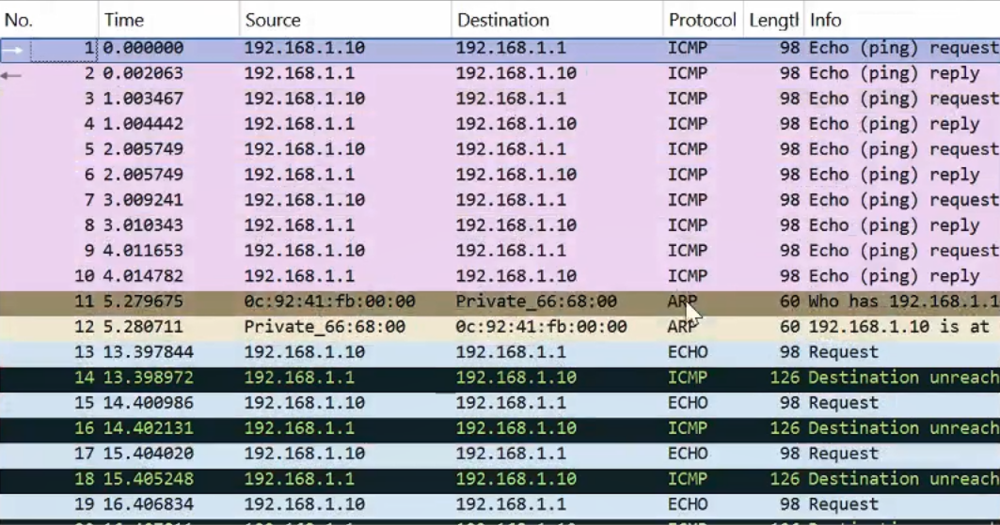

---
## Front matter
lang: ru-RU
title: Лабораторная работа
subtitle: Номер 5
author:
  - Кобзев Д. К. 
institute:
  - Российский университет дружбы народов, Москва, Россия
date: 1 декабря 2025

## i18n babel
babel-lang: russian
babel-otherlangs: english

## Pdf output format
fontsize: 8pt

## Formatting pdf
toc: false
toc-title: Содержание
slide_level: 2
aspectratio: 169
section-titles: true
theme: metropolis
##Fonts
mainfont: Liberation Serif
sansfont: Liberation Sans
monofont: Liberation Mono
---

# Информация

## Докладчик

:::::::::::::: {.columns align=center}
::: {.column width="70%"}

  * Кобзев Дмитрий Константинович
  * Студент
  * Российский университет дружбы народов
  * НПИбд-01-23

:::
::: {.column width="30%"}

:::
::::::::::::::

## Цель работы

Целью данной работы является построение простейших моделей сети на базе коммутатора и маршрутизаторов FRR и VyOS в GNS3, анализ трафика посредством Wireshark.

## Моделирование простейшей сети на базе коммутатора в GNS3

Запускаем GNS3 VM и GNS3. Создаем новый проект.
 
В рабочей области GNS3 размещаем коммутатор Ethernet и два VPCS.

Изменяем название устройства, включив в имя устройства имя моей учётной записи.

Соединяем VPCS с коммутатором (Рис. 12.1).

{height=60%}

## Моделирование простейшей сети на базе коммутатора в GNS3

Задаем IP-адреса 192.168.1.11 в сети 192.168.1.0/24. Сохраняем конфигурацию. Аналогичным образом задаем IP-адрес 192.168.1.12 для PC-2.

Проверяем работоспособность соединения между PC-1 и PC-2 с помощью
команды ping (Рис. 12.2).

{height=60%}

## Моделирование простейшей сети на базе коммутатора в GNS3

{height=60%}

## Анализ трафика в GNS3 посредством Wireshark

Запускаем на соединении между PC-1 и коммутатором анализатор трафика. В проекте GNS3 стартуем все узлы.

В терминале PC-2 делаем по одному эхо-запросу в ICMP-моде, в UDP-моде и TCP-моде к узлу PC-1 (Рис. 12.4).

{height=60%}

## Анализ трафика в GNS3 посредством Wireshark

Смотрим полученную информацию в Wireshark (Рис. 12.5), (Рис. 12.6).

{height=60%}

## Анализ трафика в GNS3 посредством Wireshark

{height=60%}

## Моделирование простейшей сети на базе маршрутизатора FRR в GNS3

Создаем новый проект. В рабочей области GNS3 размещаем VPCS, коммутатор Ethernet и маршрутизатор FRR. Изменяем отображаемые названия устройств. Включаем захват трафика на соединении между коммутатором и маршрутизатором. Запускаем все устройства проекта. Открываем консоль всех устройств проекта (Рис. 12.7).

{height=60%}

## Моделирование простейшей сети на базе маршрутизатора FRR в GNS3

Настраиваем IP-адресацию для интерфейса узла PC1 (Рис. 12.8).

{height=60%}

## Моделирование простейшей сети на базе маршрутизатора FRR в GNS3

Настраиваем IP-адресацию для интерфейса локальной сети маршрутизатора.

Проверяем конфигурацию маршрутизатора и настройки IP-адресации (Рис. 12.9).

{height=60%}

## Моделирование простейшей сети на базе маршрутизатора FRR в GNS3

Проверяем подключение. Узел PC1 успешно отправляет эхо-запросы на адрес маршрутизатора 192.168.1.1 (Рис. 12.10).

{height=60%}

## Моделирование простейшей сети на базе маршрутизатора FRR в GNS3

В окне Wireshark анализируем полученную информацию (Рис. 12.11), (Рис. 12.12).

{height=60%}

## Моделирование простейшей сети на базе маршрутизатора FRR в GNS3

{height=60%}

## Моделирование простейшей сети на базе маршрутизатора VyOS в GNS3

Создаем новый проект. В рабочей области GNS3 размещаем VPCS, коммутатор Ethernet и маршрутизатор VyOS. Изменяем отображаемые названия устройств. Включаем захват трафика на соединении между коммутатором и маршрутизатором. Запускаем все устройства проекта (Рис. 12.13).

{height=60%}

## Моделирование простейшей сети на базе маршрутизатора VyOS в GNS3

Настраиваем IP-адресацию для интерфейса узла PC1 (Рис. 12.10).

{height=60%}

## Моделирование простейшей сети на базе маршрутизатора VyOS в GNS3

Настройте маршрутизатор VyOS. Переходим в режим конфигурирования. Изменяем имя устройства. Задаем IP-адрес на интерфейсе eth0. Смотрим внесённые в конфигурацию изменения. Применяем изменения в конфигурации и сохраняем саму конфигурацию. Смотрим информацию об интерфейсах маршрутизатора. Выходим из режима конфигурирования (Рис. 12.15).

{height=60%}

## Моделирование простейшей сети на базе маршрутизатора VyOS в GNS3

Проверяем подключение. Узел PC1 успешно отправляет эхо-запросы на адрес маршрутизатора 192.168.1.1 (Рис. 12.16).

{height=60%}

## Моделирование простейшей сети на базе маршрутизатора VyOS в GNS3

В окне Wireshark анализируем полученную информацию (Рис. 12.17), (Рис. 12.18).

{height=60%}

## Моделирование простейшей сети на базе маршрутизатора VyOS в GNS3

{height=60%}

# Выводы

В результате выполнения лабораторной работы мною были построены простейшие модели сети на базе коммутатора и маршрутизаторов FRR и VyOS в GNS3, анализ трафика посредством Wireshark.

