---
## Front matter
lang: ru-RU
title: Лабораторная работа
subtitle: Номер 6
author:
  - Кобзев Д. К. 
institute:
  - Российский университет дружбы народов, Москва, Россия
date: 3 декабря 2025

## i18n babel
babel-lang: russian
babel-otherlangs: english

## Pdf output format
fontsize: 8pt

## Formatting pdf
toc: false
toc-title: Содержание
slide_level: 2
aspectratio: 169
section-titles: true
theme: metropolis
##Fonts
mainfont: Liberation Serif
sansfont: Liberation Sans
monofont: Liberation Mono
---

# Информация

## Докладчик

:::::::::::::: {.columns align=center}
::: {.column width="70%"}

  * Кобзев Дмитрий Константинович
  * Студент
  * Российский университет дружбы народов
  * НПИбд-01-23

:::
::: {.column width="30%"}

:::
::::::::::::::

## Цель работы

Целью данной работы является изучение принципов распределения и настройки адресного пространства на устройствах сети.

## Разбиение IPv4-сети на подсети

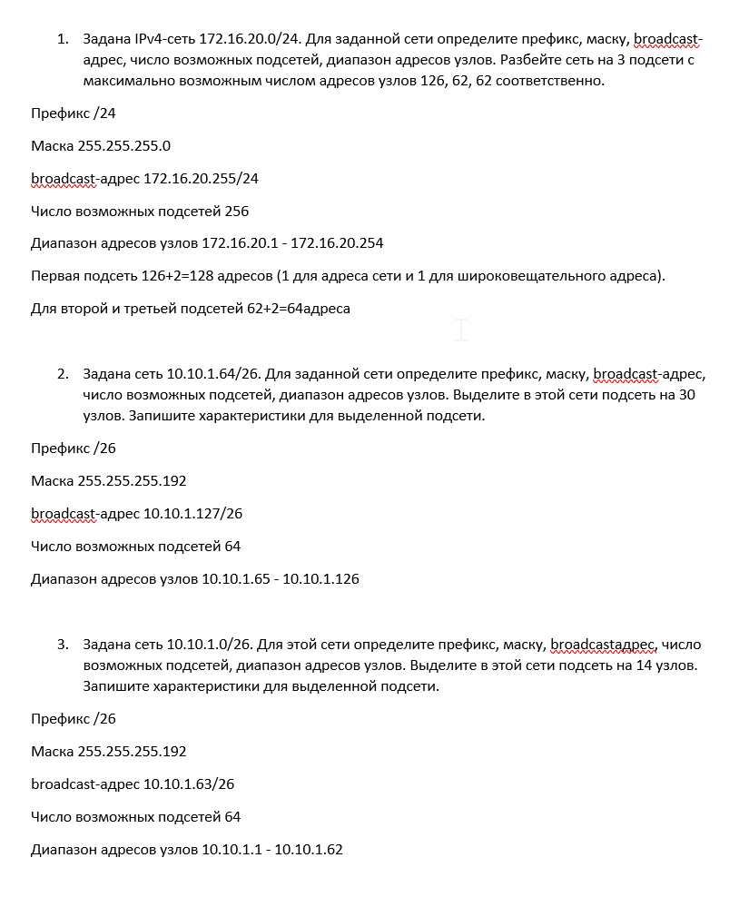{height=60%}

## Разбиение IPv6-сети на подсети

{height=60%}

## Настройка двойного стека адресации IPv4 и IPv6 в локальной сети

В рабочем пространстве размещаем и соединяем устройства в соответствии с топологией. Для подсети IPv4 используем маршрутизатор FRR, а для подсети с IPv6 — маршрутизатор VyOS.
Изменяем отображаемые названия устройств.
Включаем захват трафика на соединении между сервером двойного стека адресации и ближайшим к нему коммутатором (Рис. 12.3).

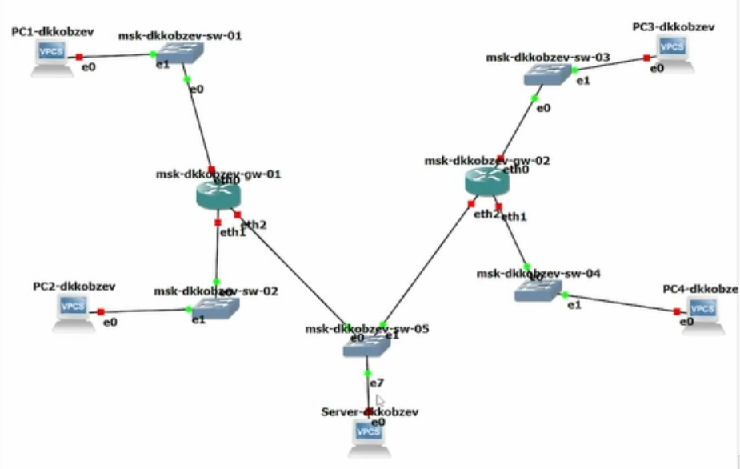{height=60%}

## Настройка двойного стека адресации IPv4 и IPv6 в локальной сети

Настраиваем IPv4-адресацию для интерфейсов узлов PC1, PC2, Server.

Смотрим на PC1 и PC2 конфигурацию IPv4 и IPv6 (Рис. 12.4), (Рис. 12.5), (Рис. 12.6).

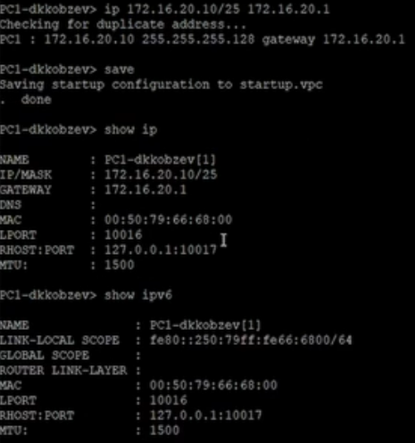{height=60%}

## Настройка двойного стека адресации IPv4 и IPv6 в локальной сети

{height=60%}

## Настройка двойного стека адресации IPv4 и IPv6 в локальной сети

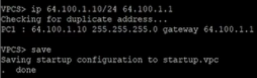{height=60%}

Настраиваем IPv4-адресацию для интерфейсов локальной сети маршрутизатора FRR msk-user-gw-01 (Рис. 12.7).

{height=60%}

## Настройка двойного стека адресации IPv4 и IPv6 в локальной сети

Проверяем конфигурацию маршрутизатора и настройки IPv4-адресации (Рис. 12.8).

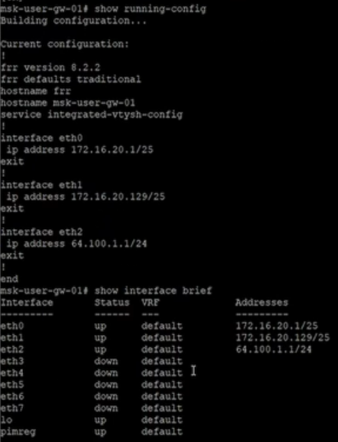{height=60%}

## Настройка двойного стека адресации IPv4 и IPv6 в локальной сети

Проверяем подключение с помощью команд ping и trace. Узлы PC1 и PC2 успешно отправляют эхо-запросы друг другу и на сервер с двойным стеком (Рис. 12.9), (Рис. 12.10).

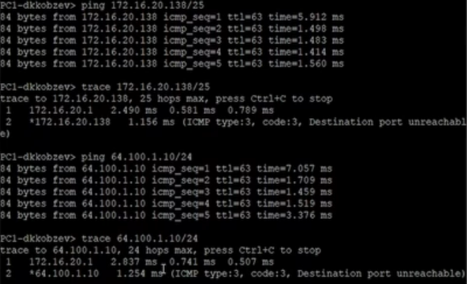{height=60%}

## Настройка двойного стека адресации IPv4 и IPv6 в локальной сети

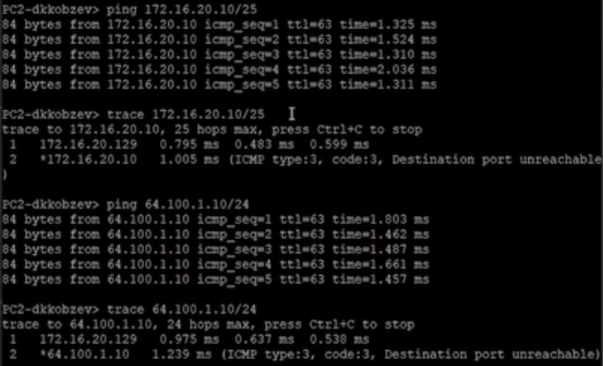{height=60%}

Настраиваем IPv6-адресацию для интерфейсов узлов PC3, PC4, Server. Смотрим на PC3 и PC4 конфигурацию IPv4 и IPv6 (Рис. 12.11), (Рис. 12.12), (Рис. 12.13).

## Настройка двойного стека адресации IPv4 и IPv6 в локальной сети

{height=60%}

## Настройка двойного стека адресации IPv4 и IPv6 в локальной сети

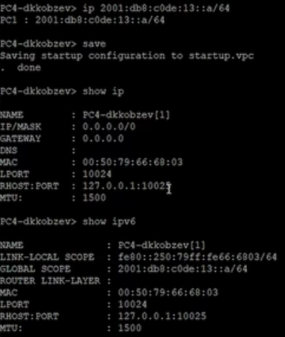{height=60%}

## Настройка двойного стека адресации IPv4 и IPv6 в локальной сети

{height=60%}

## Настройка двойного стека адресации IPv4 и IPv6 в локальной сети

Настраиваем IPv6-адресацию для интерфейсов локальной сети маршрутизатора VyOS msk-user-gw-02. Переходим в режим конфигурирования, изменяем имя устройства.
Назначаем IPv6-адреса маршрутизатору msk-user-gw-02 (Рис. 12.14).

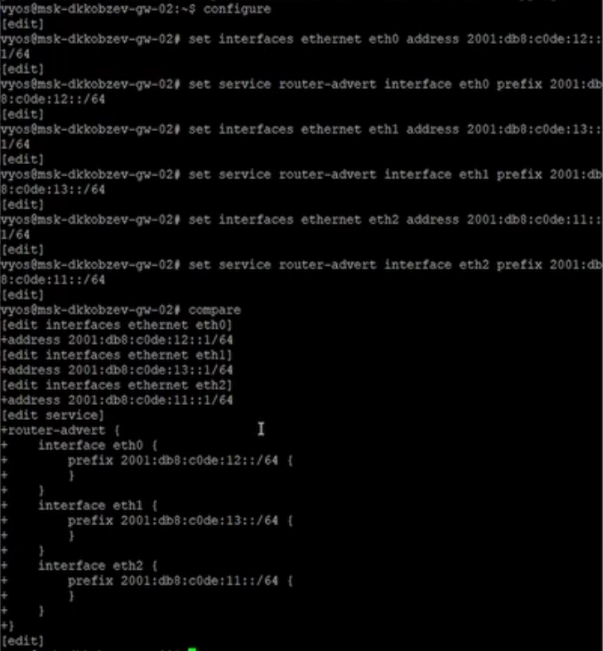{height=60%}

## Задание для самостоятельного выполнения

Предполагается, что маршрутизатор разбивает сеть на две подсети с адресами
IPv4 и IPv6:
– подсеть 1: 10.10.1.96/27; 2001:DB8:1:1::/64;
– подсеть 2: 10.10.1.16/28; 2001:DB8:1:4::/64. 
Характеризуем подсети, указав, какие адреса в них входят (Рис. 12.15).

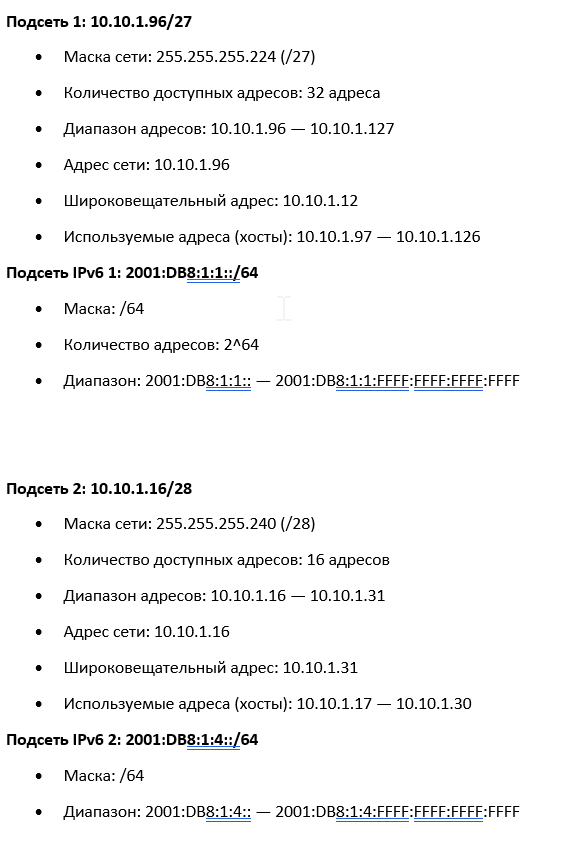{height=60%}

## Задание для самостоятельного выполнения

Предлогаем вариант таблицы адресации для заданной топологии и адресного пространства, причём для интерфейсов маршрутизатора выбрать наименьший адрес в подсети (Рис. 12.16).

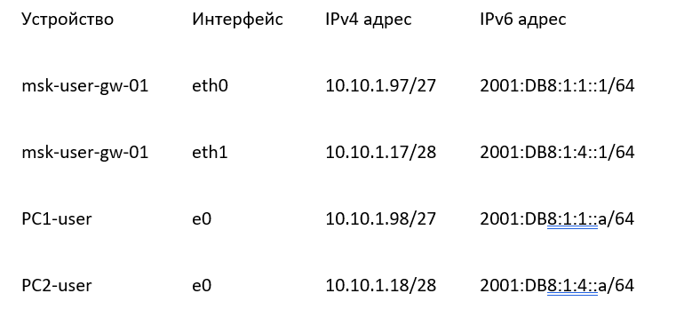{height=60%}

## Задание для самостоятельного выполнения

Настраиваем IP-адресацию на маршрутизаторе VyOS и оконечных устройствах, причём на интерфейсах маршрутизатора установить наименьший адрес в подсети (Рис. 12.17), (Рис. 12.18).

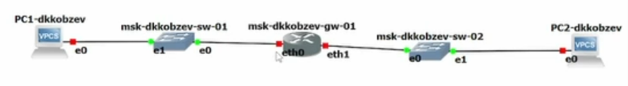{height=60%}

## Задание для самостоятельного выполнения

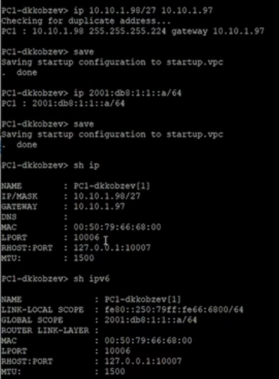{height=60%}

## Задание для самостоятельного выполнения

{height=60%}

## Задание для самостоятельного выполнения

{height=60%}

## Выводы

В результате выполнения лабораторной работы мною были изучены принципы распределения и настройки адресного пространства на устройствах сети.