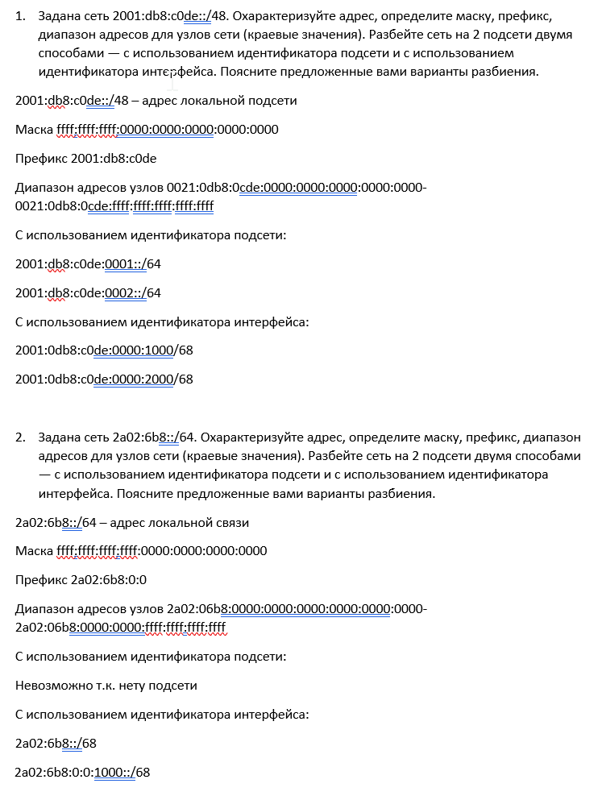
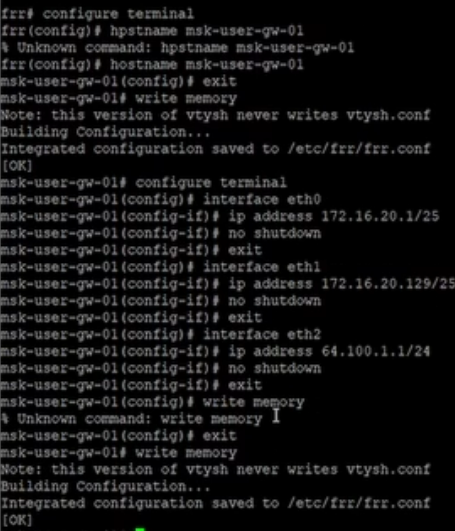
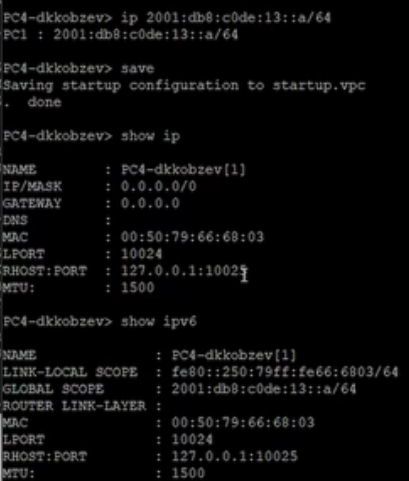
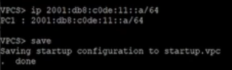
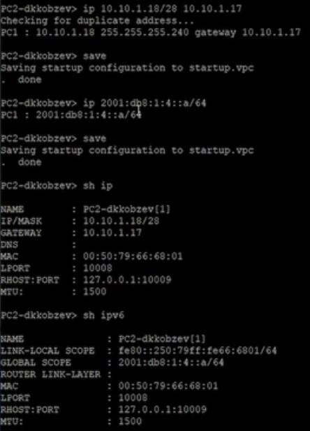
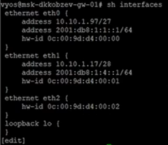

---
## Front matter
title: Лабораторная работа
subtitle: Номер 6
author: "Кобзев Д. К."

## Generic otions
lang: ru-RU
toc-title: "Содержание"

## Bibliography
bibliography: bib/cite.bib
csl: /home/dkkobzev/pandoc/csl/gost-r-7-0-5-2008-numeric.csl

## Pdf output format
toc: true # Table of contents
toc-depth: 2
lof: true # List of figures
lot: true # List of tables
fontsize: 12pt
linestretch: 1.5
papersize: a4
documentclass: scrreprt
## I18n polyglossia
polyglossia-lang:
  name: russian
  options:
	- spelling=modern
	- babelshorthands=true
polyglossia-otherlangs:
  name: english
## I18n babel
babel-lang: russian
babel-otherlangs: english
## Fonts
mainfont: Liberation Serif
romanfont: Liberation Serif
sansfont: Liberation Sans
monofont: Liberation Mono
mathfont: STIX Two Math
mainfontoptions: Ligatures=Common,Ligatures=TeX,Scale=0.94
romanfontoptions: Ligatures=Common,Ligatures=TeX,Scale=0.94
sansfontoptions: Ligatures=Common,Ligatures=TeX,Scale=MatchLowercase,Scale=0.94
monofontoptions: Scale=MatchLowercase,Scale=0.94,FakeStretch=0.9

## Pandoc-crossref LaTeX customization
figureTitle: "Рис."
tableTitle: "Таблица"
listingTitle: "Листинг"
lofTitle: "Список иллюстраций"
lotTitle: "Список таблиц"
lolTitle: "Листинги"
## Misc options
indent: true
header-includes:
  - \usepackage{indentfirst}
  - \usepackage{float} # keep figures where there are in the text
  - \floatplacement{figure}{H} # keep figures where there are in the text
---

# Цель работы

Целью данной работы является изучение принципов распределения и настройки адресного пространства на устройствах сети.

# Выполнение лабораторной работы

{height=60%}

{height=60%}

В рабочем пространстве размещаем и соединяем устройства в соответствии с топологией. Для подсети IPv4 используем маршрутизатор FRR, а для подсети с IPv6 — маршрутизатор VyOS.
Изменяем отображаемые названия устройств.
Включаем захват трафика на соединении между сервером двойного стека адресации и ближайшим к нему коммутатором (Рис. 12.3).

{height=60%}

Настраиваем IPv4-адресацию для интерфейсов узлов PC1, PC2, Server.

Смотрим на PC1 и PC2 конфигурацию IPv4 и IPv6 (Рис. 12.4), (Рис. 12.5), (Рис. 12.6).

{height=60%}

{height=60%}

{height=60%}

Настраиваем IPv4-адресацию для интерфейсов локальной сети маршрутизатора FRR msk-user-gw-01 (Рис. 12.7).

{height=60%}

Проверяем конфигурацию маршрутизатора и настройки IPv4-адресации (Рис. 12.8).

{height=60%}

Проверяем подключение с помощью команд ping и trace. Узлы PC1 и PC2 успешно отправляют эхо-запросы друг другу и на сервер с двойным стеком (Рис. 12.9), (Рис. 12.10).

{height=60%}

{height=60%}

Настраиваем IPv6-адресацию для интерфейсов узлов PC3, PC4, Server. Смотрим на PC3 и PC4 конфигурацию IPv4 и IPv6 (Рис. 12.11), (Рис. 12.12), (Рис. 12.13).

{height=60%}

{height=60%}

{height=60%}

Настраиваем IPv6-адресацию для интерфейсов локальной сети маршрутизатора VyOS msk-user-gw-02. Переходим в режим конфигурирования, изменяем имя устройства.
Назначаем IPv6-адреса маршрутизатору msk-user-gw-02 (Рис. 12.14).

{height=60%}

Предполагается, что маршрутизатор разбивает сеть на две подсети с адресами
IPv4 и IPv6:
– подсеть 1: 10.10.1.96/27; 2001:DB8:1:1::/64;
– подсеть 2: 10.10.1.16/28; 2001:DB8:1:4::/64. 
Характеризуем подсети, указав, какие адреса в них входят (Рис. 12.15).

{height=60%}

Предлогаем вариант таблицы адресации для заданной топологии и адресного пространства, причём для интерфейсов маршрутизатора выбрать наименьший адрес в подсети (Рис. 12.16).

{height=60%}

Настраиваем IP-адресацию на маршрутизаторе VyOS и оконечных устройствах, причём на интерфейсах маршрутизатора установить наименьший адрес в подсети (Рис. 12.17), (Рис. 12.18).

{height=60%}

{height=60%}

{height=60%}

{height=60%}

# Выводы

В результате выполнения лабораторной работы мною были изучены принципы распределения и настройки адресного пространства на устройствах сети.

# Список литературы{.unnumbered}