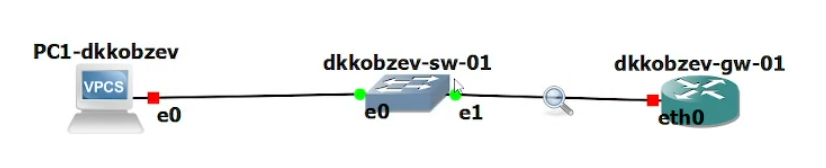
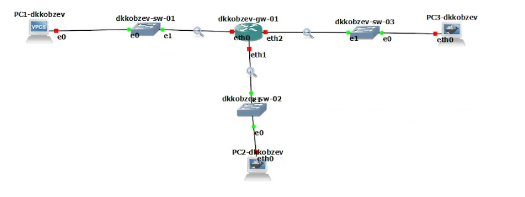
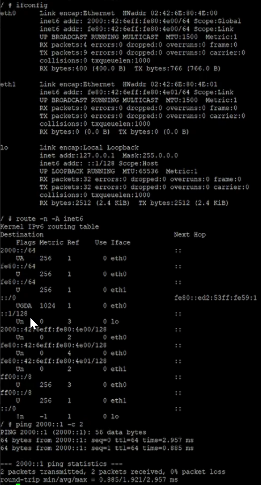
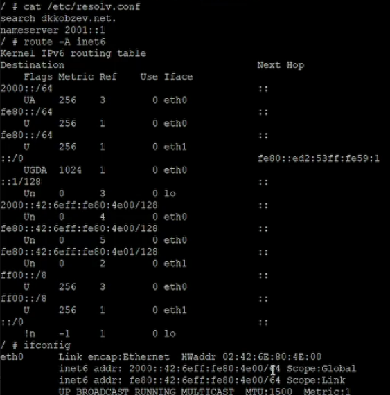
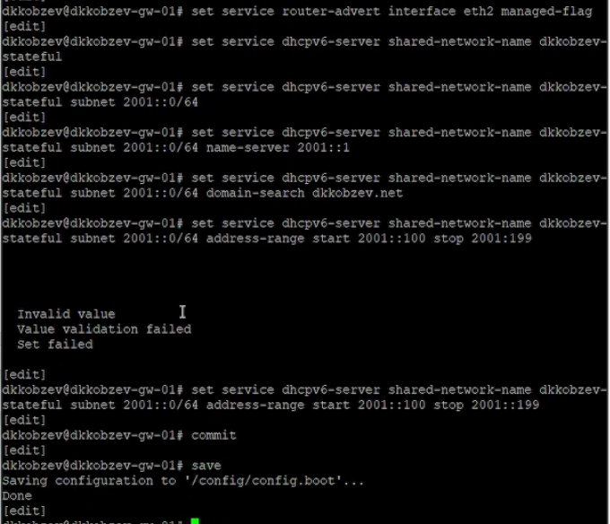

---
## Front matter
lang: ru-RU
title: Лабораторная работа
subtitle: Номер 7
author:
  - Кобзев Д. К. 
institute:
  - Российский университет дружбы народов, Москва, Россия
date: 4 декабря 2025

## i18n babel
babel-lang: russian
babel-otherlangs: english

## Pdf output format
fontsize: 8pt

## Formatting pdf
toc: false
toc-title: Содержание
slide_level: 2
aspectratio: 169
section-titles: true
theme: metropolis
##Fonts
mainfont: Liberation Serif
sansfont: Liberation Sans
monofont: Liberation Mono
---

# Информация

## Докладчик

:::::::::::::: {.columns align=center}
::: {.column width="70%"}

  * Кобзев Дмитрий Константинович
  * Студент
  * Российский университет дружбы народов
  * НПИбд-01-23

:::
::: {.column width="30%"}

:::
::::::::::::::

## Цель работы

Целью данной работы является получение навыков настройки службы DHCP на сетевом оборудовании для распределения адресов IPv4 и IPv6.

## Настройка DHCP в случае IPv4

В рабочем пространстве размещаем и соединяем устройства в соответствии с топологией. Используем маршрутизатор VyOS и хост (клиент) VPCS.
Изменяем отображаемые названия устройств.
Включаем захват трафика на соединении между коммутатором sw-01 и маршрутизатором gw-01 (Рис. 12.1).

{height=60%}

## Настройка DHCP в случае IPv4

На маршрутизаторе переходим в режим конфигурирования, изменяем имя устройства и доменное имя, заменяем системного пользователя, заданного по умолчанию, на моего пользователя.
На маршрутизаторе под созданным пользователем переходим в режим конфигурирования и настраиваем адресацию IPv4.
Добавляем конфигурацию DHCP-сервера на маршрутизаторе (Рис. 12.2).

{height=60%}

## Настройка DHCP в случае IPv4

Смотрим статистику DHCP-сервера и выданных адресов (Рис. 12.3).

{height=60%}

## Настройка DHCP в случае IPv4

Настраиваем оконечное устройство PC1.
Проверяем конфигурацию IPv4 на узле, пингуем маршрутизатор (Рис. 12.4).

{height=60%}

## Настройка DHCP в случае IPv4

На маршрутизаторе вновь смотрим статистику DHCP-сервера и выданные адреса (Рис. 12.5).

{height=60%}

## Настройка DHCP в случае IPv6

В рабочем пространстве дополняем сеть, разместив и соединив устройства в соответствии с топологией. Используем хост Kali Linux CLI.
Изменяем отображаемые названия устройств.
Включаем захват трафика на соединениях между маршрутизатором gw-01 и коммутаторами sw-02 и sw-03. (Рис. 12.6).

{height=60%}

## Настройка DHCP в случае IPv6

Настраиваем адресацию IPv6 на маршрутизаторе.
На маршрутизаторе настраиваем DHCPv6 без отслеживания состояния. Настраиваем объявления о маршрутизаторах (Рис. 12.7).

{height=60%}

## Настройка DHCP в случае IPv6

Добавляем конфигурации DHCP-сервера (Рис. 12.8).

{height=60%}

## Настройка DHCP в случае IPv6

На узле PC2 проверяем настройки сети.
На узле PC2 пингуем маршрутизатор (Рис. 12.9).

{height=60%}

## Настройка DHCP в случае IPv6

На узле PC2 получаем адрес по DHCPv6.
Проверяем настройки DNS. (Рис. 12.10).

{height=60%}

## Настройка DHCP в случае IPv6

На маршрутизаторе настраиваем DHCPv6 с отслеживанием состояния.
На интерфейсе eth2 маршрутизатора настраиваем объявления о маршрутизаторах.
Добавляем конфигурацию DHCP-сервера на маршрутизаторе (Рис. 12.11).

{height=60%}

## Настройка DHCP в случае IPv6

Подключаемся к узлу PC3 и проверяем настройки сети (Рис. 12.12).

{height=60%}

## Настройка DHCP в случае IPv6

На узле PC3 получаем адрес по DHCPv6.
Вновь на узле PC3 проверяем настройки сети, пингуем маршрутизатор, проверяем настройки DNS (Рис. 12.13).

{height=60%}

## Выводы

В результате выполнения лабораторной работы мною были получены навыки настройки службы DHCP на сетевом оборудовании для распределения адресов IPv4 и IPv6.