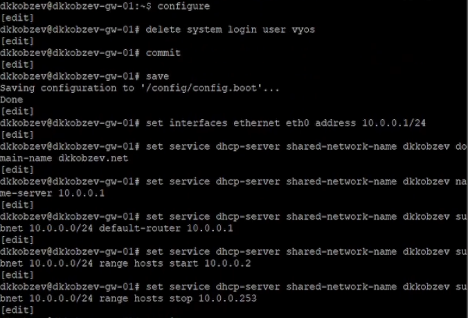
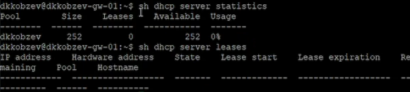
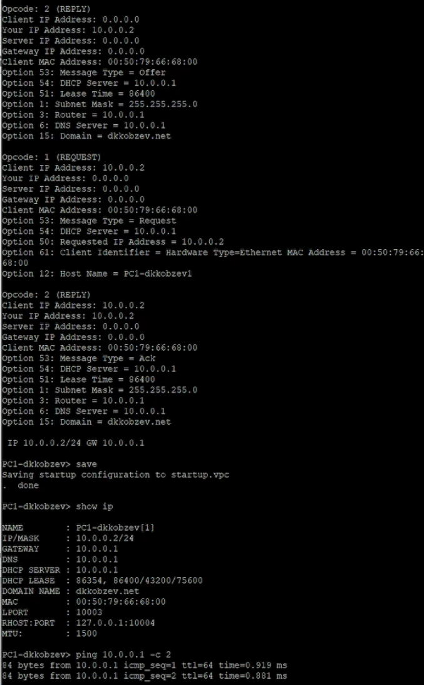
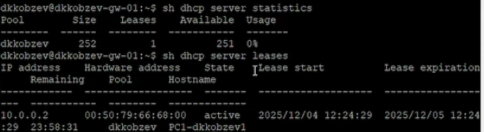
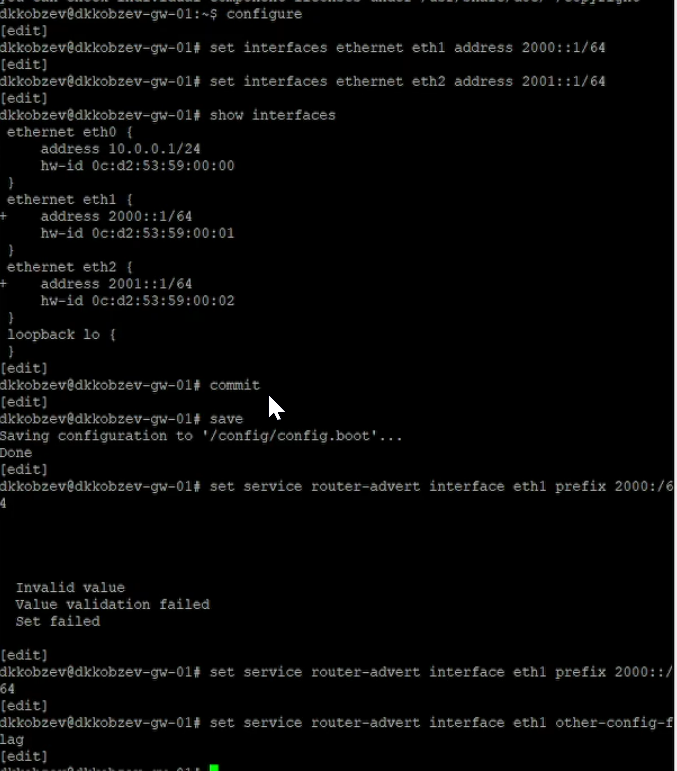
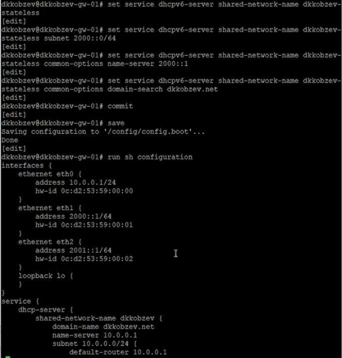
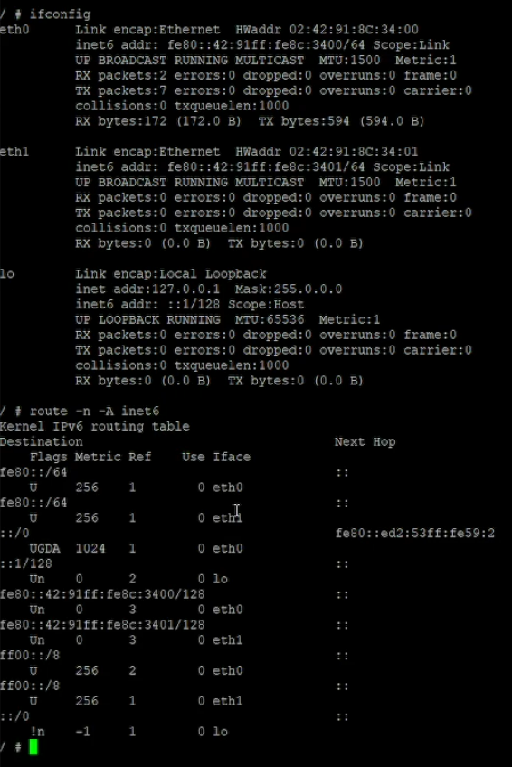
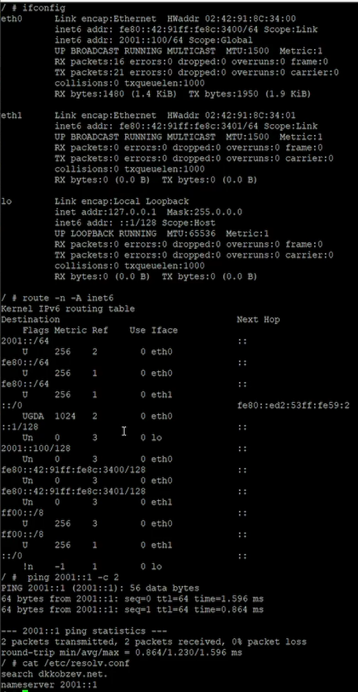

---
## Front matter
title: Лабораторная работа
subtitle: Номер 7
author: "Кобзев Д. К."

## Generic otions
lang: ru-RU
toc-title: "Содержание"

## Bibliography
bibliography: bib/cite.bib
csl: /home/dkkobzev/pandoc/csl/gost-r-7-0-5-2008-numeric.csl

## Pdf output format
toc: true # Table of contents
toc-depth: 2
lof: true # List of figures
lot: true # List of tables
fontsize: 12pt
linestretch: 1.5
papersize: a4
documentclass: scrreprt
## I18n polyglossia
polyglossia-lang:
  name: russian
  options:
	- spelling=modern
	- babelshorthands=true
polyglossia-otherlangs:
  name: english
## I18n babel
babel-lang: russian
babel-otherlangs: english
## Fonts
mainfont: Liberation Serif
romanfont: Liberation Serif
sansfont: Liberation Sans
monofont: Liberation Mono
mathfont: STIX Two Math
mainfontoptions: Ligatures=Common,Ligatures=TeX,Scale=0.94
romanfontoptions: Ligatures=Common,Ligatures=TeX,Scale=0.94
sansfontoptions: Ligatures=Common,Ligatures=TeX,Scale=MatchLowercase,Scale=0.94
monofontoptions: Scale=MatchLowercase,Scale=0.94,FakeStretch=0.9

## Pandoc-crossref LaTeX customization
figureTitle: "Рис."
tableTitle: "Таблица"
listingTitle: "Листинг"
lofTitle: "Список иллюстраций"
lotTitle: "Список таблиц"
lolTitle: "Листинги"
## Misc options
indent: true
header-includes:
  - \usepackage{indentfirst}
  - \usepackage{float} # keep figures where there are in the text
  - \floatplacement{figure}{H} # keep figures where there are in the text
---

# Цель работы

Целью данной работы является получение навыков настройки службы DHCP на сетевом оборудовании для распределения адресов IPv4 и IPv6.

# Выполнение лабораторной работы

В рабочем пространстве размещаем и соединяем устройства в соответствии с топологией. Используем маршрутизатор VyOS и хост (клиент) VPCS.
Изменяем отображаемые названия устройств.
Включаем захват трафика на соединении между коммутатором sw-01 и маршрутизатором gw-01 (Рис. 12.1).

{height=60%}

На маршрутизаторе переходим в режим конфигурирования, изменяем имя устройства и доменное имя, заменяем системного пользователя, заданного по умолчанию, на моего пользователя.
На маршрутизаторе под созданным пользователем переходим в режим конфигурирования и настраиваем адресацию IPv4.
Добавляем конфигурацию DHCP-сервера на маршрутизаторе (Рис. 12.2).

{height=60%}

Смотрим статистику DHCP-сервера и выданных адресов (Рис. 12.3).

{height=60%}

Настраиваем оконечное устройство PC1.
Проверяем конфигурацию IPv4 на узле, пингуем маршрутизатор (Рис. 12.4).

{height=60%}

На маршрутизаторе вновь смотрим статистику DHCP-сервера и выданные адреса (Рис. 12.5).

{height=60%}

В рабочем пространстве дополняем сеть, разместив и соединив устройства в соответствии с топологией. Используем хост Kali Linux CLI.
Изменяем отображаемые названия устройств.
Включаем захват трафика на соединениях между маршрутизатором gw-01 и коммутаторами sw-02 и sw-03. (Рис. 12.6).

{height=60%}

Настраиваем адресацию IPv6 на маршрутизаторе.
На маршрутизаторе настраиваем DHCPv6 без отслеживания состояния. Настраиваем объявления о маршрутизаторах (Рис. 12.7).

{height=60%}

Добавляем конфигурации DHCP-сервера (Рис. 12.8).

{height=60%}

На узле PC2 проверяем настройки сети.
На узле PC2 пингуем маршрутизатор (Рис. 12.9).

{height=60%}

На узле PC2 получаем адрес по DHCPv6.
Проверяем настройки DNS. (Рис. 12.10).

{height=60%}

На маршрутизаторе настраиваем DHCPv6 с отслеживанием состояния.
На интерфейсе eth2 маршрутизатора настраиваем объявления о маршрутизаторах.
Добавляем конфигурацию DHCP-сервера на маршрутизаторе (Рис. 12.11).

{height=60%}

Подключаемся к узлу PC3 и проверяем настройки сети (Рис. 12.12).

{height=60%}

На узле PC3 получаем адрес по DHCPv6.
Вновь на узле PC3 проверяем настройки сети, пингуем маршрутизатор, проверяем настройки DNS (Рис. 12.13).

{height=60%}

# Выводы

В результате выполнения лабораторной работы мною были получены навыки настройки службы DHCP на сетевом оборудовании для распределения адресов IPv4 и IPv6.

# Список литературы{.unnumbered}