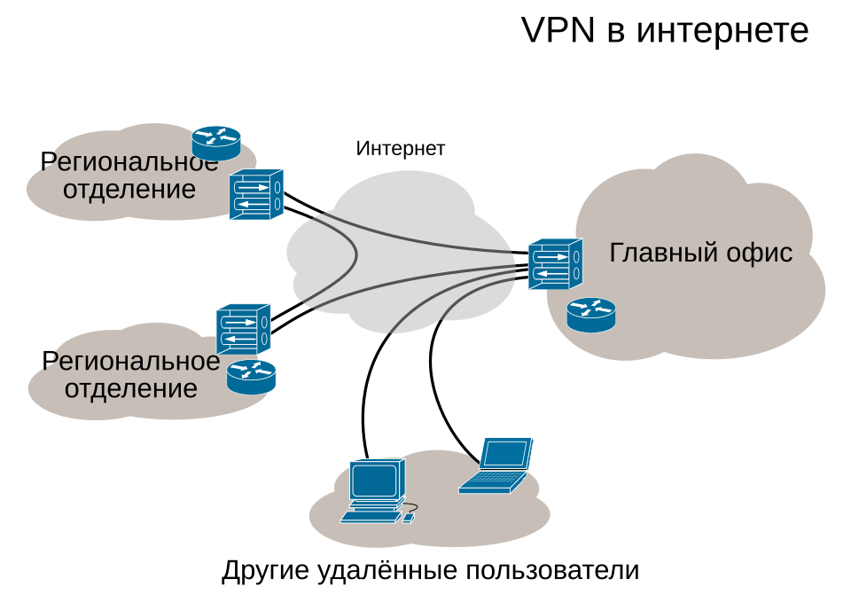
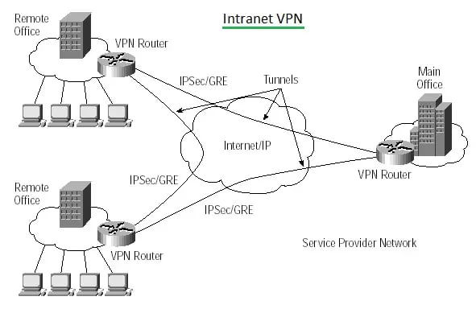

---
## Front matter
lang: ru-RU
title: Интранет и виртуальные частные сети
subtitle: Сетевые технологии
author:
  - Кобзев Д. К. 
institute:
  - Российский университет дружбы народов, Москва, Россия
date: 20 ноября 2025

## i18n babel
babel-lang: russian
babel-otherlangs: english

## Pdf output format
fontsize: 8pt

## Formatting pdf
toc: false
toc-title: Содержание
slide_level: 2
aspectratio: 169
section-titles: true
theme: metropolis
##Fonts
mainfont: Liberation Serif
sansfont: Liberation Sans
monofont: Liberation Mono
---

# Информация

## Докладчик

:::::::::::::: {.columns align=center}
::: {.column width="70%"}

  * Кобзев Дмитрий Константинович
  * Студент
  * Российский университет дружбы народов
  * НПИбд-01-23

:::
::: {.column width="30%"}

:::
::::::::::::::

## Введение

**Тема:** Интранет и виртуальные частные сети

**Актуальность:**

* Защита данных при передаче через Интернет

* Организация безопасного доступа к внутренним ресурсам

* Масштабируемость сетевой инфраструктуры

**Цель:** Рассмотреть архитектурные принципы и ключевые компоненты интранета и виртуальных частных сетей.

## Интранет

**Интранет** - локальная сеть, построенная на технологиях и использующая стандарты Интернета. Используется в качестве защищенного хранилища корпоративных данных и как пространство для эффективной коммуникации сотрудников и решения рабочих задач внутри компании.

**Ключевые архитектурные принципы:** 

1. Использование частного адресного пространства для изоляции от глобального Интернета.

2. Организация внутренней маршрутизации с помощью протоколов IGP, например OSPF.

**OSPF** - протокол динамической маршрутизации, основанный на технологии отслеживания состояния канала и использующий для нахождения кратчайшего пути алгоритм Дейкстры. Как и все протоколы маршрутизации класса Link-State, протокол OSPF предназначен для построения внутренних маршрутов между маршрутизаторами одной автономной системы.

{height=35%}

## Виртуальные частные сети

**Виртуальная частная сеть (VPN)** - это оверлейная сеть, использующая виртуализацию сетей для расширения частного IP-адреса через публичную сеть, такую как интернет, с помощью шифрования и туннелирования. В VPN туннельный протокол используется для передачи сетевых сообщений от одного хоста к другому.

Чаще всего для создания виртуальной сети используется инкапсуляция протокола PPP в какой-нибудь другой протокол - IP (такой способ использует реализация PPTP — Point-to-Point Tunneling Protocol) или Ethernet (PPPoE)

**PPTP** - туннельный протокол типа точка-точка, позволяющий компьютеру устанавливать защищённое соединение с сервером за счёт создания специального туннеля в стандартной, незащищённой сети. PPTP может также использоваться для организации туннеля между двумя локальными сетями. РРТР использует дополнительное TCP-соединение для обслуживания туннеля.
 
{height=40%}

## Технологические основы VPN (на примере IPsec)

**IPsec** - это наиболее широко признанный, поддерживаемый и стандартизованный из всех протоколов VPN. Для обеспечения совместной работы он подходит лучше остальных. IPSec лежит в основе открытых стандартов, в которых описан целый набор безопасных протоколов, работающих поверх существующего стека IP. Он предоставляет службы аутентификации и шифрования данных на сетевом уровне модели OSI и может быть реализован на любом устройстве, которое работает по протоколу IP. В отличие от многих других схем шифрования, которые защищают конкретный протокол верхнего уровня, IPSec, работающий на нижнем уровне, может защитить весь IP-трафик. Он применяется также в сочетании с туннельными протоколами на канальном уровне для шифрования и аутентификации трафика, передаваемого по протоколам, отличным от IP.

Протокол **IPSec** состоит из трех основных частей:

* Заголовка аутентификации (Authentication Header - АН);

* Безопасно инкапсулированной полезной нагрузки (Encapsulating Security Payload - ESP);

* Схемы обмена ключами через Internet (Internet Key Exchange - IKE).

Заголовок АН добавляется после заголовка IP и обеспечивает аутентификацию на уровне пакета и целостность данных. Гарантируется, что пакет не был изменен на пути следования и поступил из ожидаемого источника. ESP обеспечивает конфиденциальность, аутентификацию источника данных, целостность, опциональную защиту от атаки повторного сеанса и до некоторой степени скрытность механизма управления потоком. IKE обеспечивает согласование настроек служб безопасности между сторонами-участниками.

## Взаимодействие Intranet и VPN

**Intranet VPN**
Используется для объединения в единую защищённую сеть нескольких распределённых филиалов одной организации, обменивающихся данными по открытым каналам связи.

**Remote Access VPN**
Используется для создания защищённого канала между сегментом корпоративной сети и  удалённым сотрудником через защищённые туннели.

{height=60%}

## Заключение

VPN и интранет действительно эффективно дополняют друг друга, создавая безопасный и доступный канал связи для удаленных пользователей и филиалов к внутренней сети организации.
