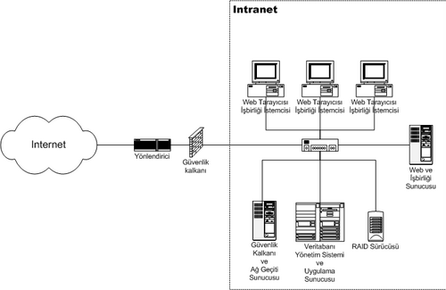
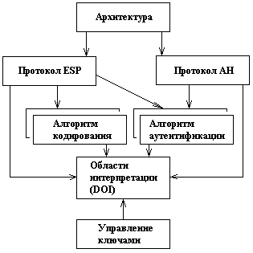

---
## Front matter
title: "Интранет и виртуальные частные сети"
subtitle: "Сетевые технологии"
author: "Кобзев Д. К."

## Generic otions
lang: ru-RU
toc-title: "Содержание"

## Bibliography
bibliography: bib/cite.bib
csl: /home/dkkobzev/pandoc/csl/gost-r-7-0-5-2008-numeric.csl

## Pdf output format
toc: true # Table of contents
toc-depth: 2
lof: true # List of figures
lot: true # List of tables
fontsize: 12pt
linestretch: 1.5
papersize: a4
documentclass: scrreprt
## I18n polyglossia
polyglossia-lang:
  name: russian
  options:
	- spelling=modern
	- babelshorthands=true
polyglossia-otherlangs:
  name: english
## I18n babel
babel-lang: russian
babel-otherlangs: english
## Fonts
mainfont: Liberation Serif
romanfont: Liberation Serif
sansfont: Liberation Sans
monofont: Liberation Mono
mathfont: STIX Two Math
mainfontoptions: Ligatures=Common,Ligatures=TeX,Scale=0.94
romanfontoptions: Ligatures=Common,Ligatures=TeX,Scale=0.94
sansfontoptions: Ligatures=Common,Ligatures=TeX,Scale=MatchLowercase,Scale=0.94
monofontoptions: Scale=MatchLowercase,Scale=0.94,FakeStretch=0.9

## Pandoc-crossref LaTeX customization
figureTitle: "Рис."
tableTitle: "Таблица"
listingTitle: "Листинг"
lofTitle: "Список иллюстраций"
lotTitle: "Список таблиц"
lolTitle: "Листинги"
## Misc options
indent: true
header-includes:
  - \usepackage{indentfirst}
  - \usepackage{float} # keep figures where there are in the text
  - \floatplacement{figure}{H} # keep figures where there are in the text
---

# Введение

**Тема:** Интранет и виртуальные частные сети

**Актуальность:**

* Защита данных при передаче через Интернет

* Организация безопасного доступа к внутренним ресурсам

* Масштабируемость сетевой инфраструктуры

**Цель:** Рассмотреть архитектурные принципы и ключевые компоненты интранета и виртуальных частных сетей.

# Интранет

**Интранет** - локальная сеть, построенная на технологиях и использующая стандарты Интернета. Используется в качестве защищенного хранилища корпоративных данных и как пространство для эффективной коммуникации сотрудников и решения рабочих задач внутри компании.

**Ключевые архитектурные принципы:** 

1. Использование частного адресного пространства для изоляции от глобального Интернета.

2. Организация внутренней маршрутизации с помощью протоколов IGP, например OSPF.

**OSPF** - протокол динамической маршрутизации, основанный на технологии отслеживания состояния канала и использующий для нахождения кратчайшего пути алгоритм Дейкстры. Как и все протоколы маршрутизации класса Link-State, протокол OSPF предназначен для построения внутренних маршрутов между маршрутизаторами одной автономной системы.

{height=40%}

# Виртуальные частные сети

**Виртуальная частная сеть (VPN)** - это оверлейная сеть, использующая виртуализацию сетей для расширения частного IP-адреса через публичную сеть, такую как интернет, с помощью шифрования и туннелирования. В VPN туннельный протокол используется для передачи сетевых сообщений от одного хоста к другому.

Чаще всего для создания виртуальной сети используется инкапсуляция протокола PPP в какой-нибудь другой протокол - IP (такой способ использует реализация PPTP — Point-to-Point Tunneling Protocol) или Ethernet (PPPoE)

**PPTP** - туннельный протокол типа точка-точка, позволяющий компьютеру устанавливать защищённое соединение с сервером за счёт создания специального туннеля в стандартной, незащищённой сети. PPTP может также использоваться для организации туннеля между двумя локальными сетями. РРТР использует дополнительное TCP-соединение для обслуживания туннеля.
 
{height=50%}

# Технологические основы VPN (на примере IPsec)

**IPsec** - это наиболее широко признанный, поддерживаемый и стандартизованный из всех протоколов VPN. Для обеспечения совместной работы он подходит лучше остальных. IPSec лежит в основе открытых стандартов, в которых описан целый набор безопасных протоколов, работающих поверх существующего стека IP. Он предоставляет службы аутентификации и шифрования данных на сетевом уровне модели OSI и может быть реализован на любом устройстве, которое работает по протоколу IP. В отличие от многих других схем шифрования, которые защищают конкретный протокол верхнего уровня, IPSec, работающий на нижнем уровне, может защитить весь IP-трафик. Он применяется также в сочетании с туннельными протоколами на канальном уровне для шифрования и аутентификации трафика, передаваемого по протоколам, отличным от IP.

Протокол **IPSec** состоит из трех основных частей:

* Заголовка аутентификации (Authentication Header - АН);

* Безопасно инкапсулированной полезной нагрузки (Encapsulating Security Payload - ESP);

* Схемы обмена ключами через Internet (Internet Key Exchange - IKE).

Заголовок АН добавляется после заголовка IP и обеспечивает аутентификацию на уровне пакета и целостность данных. Гарантируется, что пакет не был изменен на пути следования и поступил из ожидаемого источника. ESP обеспечивает конфиденциальность, аутентификацию источника данных, целостность, опциональную защиту от атаки повторного сеанса и до некоторой степени скрытность механизма управления потоком. IKE обеспечивает согласование настроек служб безопасности между сторонами-участниками.

{height=60%}

# Взаимодействие Intranet и VPN

**Intranet VPN**
Используется для объединения в единую защищённую сеть нескольких распределённых филиалов одной организации, обменивающихся данными по открытым каналам связи.

**Remote Access VPN**
Используется для создания защищённого канала между сегментом корпоративной сети и  удалённым сотрудником через защищённые туннели.

{height=60%}

{height=60%}

# Заключение

VPN и интранет действительно эффективно дополняют друг друга, создавая безопасный и доступный канал связи для удаленных пользователей и филиалов к внутренней сети организации.

# Список литературы{.unnumbered}
